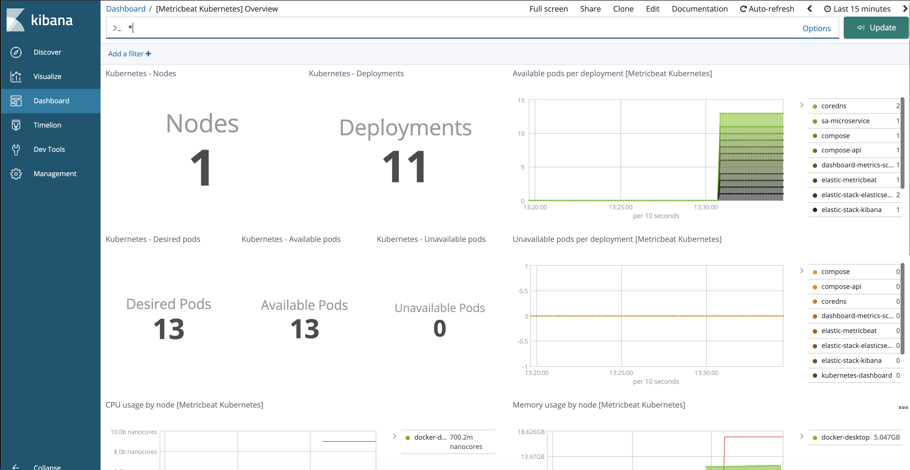
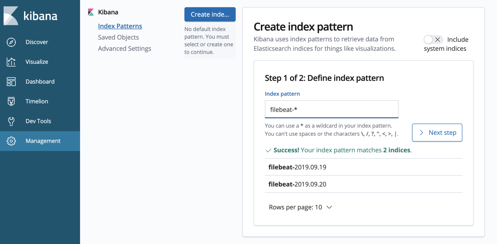
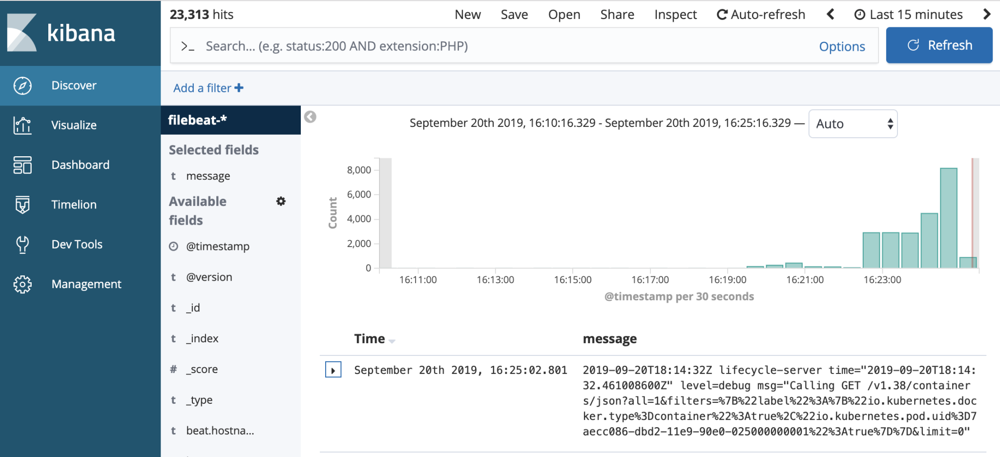

# Kubernetes ELK Example

Demo Kubernetes ELK stack. It install ELK stack using Helm charts.


## Getting Started

These instructions will get you ELK Stack up and running on your minikube for demo and testing purposes. 

### Prerequisites

What things you need to install the software and how to install them

```
Minikube
Helm
```

### Installing

Running following shell script to install ELK stack.

Follow http://localhost:5601/ to view the dashboard

You can then of course create an index pattern for filebeat and browse those entries:




```
./install.sh
```

### Un-installing

Running following shell script to un-install ELK 

```
./uninstall.sh
```

## Built With

* [Shell Script](https://en.wikipedia.org/wiki/Shell_script) 
* [Helm](https://helm.sh/docs/topics/charts/) 
* [Elastic-stack Helm Chart](**‌https://github.com/helm/charts/tree/master/stable/elastic-stack) 
	* Elasticsearch
	* Logstash
	* Kibana
    * kube-state-metrics
    * Metricbeat metrics

## Versioning

We use [SemVer](http://semver.org/) for versioning. For the versions available, see the [tags on this repository](https://github.com/your/project/tags). 

## Authors

* **Mazhar Choudhry** - *Initial work* - [PurpleBooth](https://github.com/mazrc)


## License

This project is licensed under the MIT License - see the [LICENSE.md](LICENSE.md) file for details

## Acknowledgments / Inspirations

* Ray Gauss II (https://rgauss.com/2019/09/20/elk-stack-for-kubernetes-metrics/)

